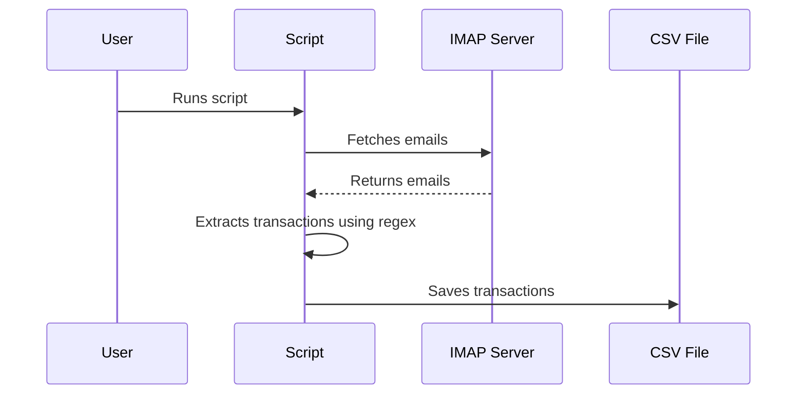

# imap-bills-exporter
Python Imap Bills Exporter

This Python script, main.py, is designed to fetch transaction notifications from an IMAP server, specifically Gmail. It logs in with specified credentials, retrieves email data from the user's inbox, extracts transaction notifications from the email data, saves the transactions to a file, and exports the transactions as text.

## Features

- Connects to a Gmail IMAP server using SSL.
- Logs in with user-provided credentials.
- Retrieves email data from the user's inbox.
- Extracts transaction notifications from the email data.
- Saves the transactions to a text file.
- Exports the transactions as a CSV file.

## Usage

1. Set up your environment variables in a .env file in the same directory as main.py. The following variables are required:

- IMAP_USER_EMAIL_ADDRESS: Your Gmail email address.
- IMAP_USER_PASSWORD: Your Gmail password.
- IMAP_SERVER: The IMAP server address (for Gmail, this is imap.gmail.com).
- IMAP_FILTER: The IMAP filter to use when searching for emails.
- IMAP_BANK_MSG_START: The start string(s) for filtering emails, separated by commas.
- IMAP_BANK_MSG_END: The end string for filtering emails.
- REGEX_BANK_FILE: The path to a file containing regular expressions for parsing transaction notifications.

## CSV Files Used for Categorization

### Accounts CSV

This file, `accounts.csv`, contains information about various accounts and is used for categorizing transactions based on the destination account.

### Trips CSV

The `trips.csv` file contains details about various trips and is used to categorize transactions based on the dates they occurred.

### Provider Name CSV

`ProviderName.csv` is used to categorize transactions based on providers. It contains provider names and their associated categories.

### Examples
#### `accounts.csv.example`
```markdown
DestAccount,AccountName,SpendType
12345678901,Account Holder A,expense_type1
98765432102,Account Holder B,expense_type2
11122233344,Account Holder C,expense_type3
```

#### `trips.csv.example`
```markdown
StartDate,EndDate,TripName,SpendType
2022-01-01,2022-01-10,Trip A,travel
2022-02-05,2022-02-15,Trip B,business
2022-03-10,2022-03-20,Trip C,holiday
```

#### `ProviderName.csv.example`
```markdown
ProviderDestName,ProviderGroup,SpendType,Filter
Provider A,Group A,expense_type4,contains
Provider B,Group B,expense_type5,contains
Provider C,Group C,expense_type6,contains
```

You can copy and paste these markdown snippets into your `README.md` file.

### Create mamba env
```bash=
mamba env create python=3.10 -f environment.yml
```
### Activate mamba env
```bash=
mamba activate imap
```

### Execution
```bash=
python main.py
```

This will start the script which connects to the IMAP server with the credentials 
provided in the environment variables. It fetches the emails, extracts the transaction 
data and saves it to a file. The transactions are then exported as text.

### Output
The output will be a CSV file named `transactions-<timestamp>.csv` in the `target` directory.
Each row in the CSV file represents a transaction with the following columns:
Type, ValueString, ValueFloat, dest, Date, time, DateTime, Account

### Diagram


This diagram represents the flow of the script. The user runs the script, which fetches 
emails from the IMAP server. The script then extracts the transactions from the emails 
and saves them to a CSV file.


## Setting up Gmail Authentication using App Password

If you're using Gmail's 2-Step Verification, accessing your emails via IMAP requires an App Password. An App Password is a 16-digit passcode that gives less secure apps or devices permission to access your Google Account.

### Steps to Generate an App Password for Gmail:

1. **Turn on 2-Step Verification**: 
    - If you haven't already, turn on [2-Step Verification](https://www.google.com/landing/2step/) for your Google Account.
    
2. **Access App Passwords Page**:
    - Go to your [Google Account](https://myaccount.google.com/).
    - On the left navigation panel, click on **Security**.
    - In the "Signing in to Google" section, select **App Passwords**. You might need to sign in again.

3. **Generate App Password**:
    - At the bottom, click **Select app** and choose the app you're using (you can select "Mail").
    - Click **Select device** and choose the device you’re using.
    - Click **Generate**.

4. **Review Generated Password**:
    - You'll see a 16-digit password on your screen. Note this down without any spaces.
    - Use this App Password where you need to enter a password in your IMAP client or application.

5. **Complete the Setup**:
    - Next to the password, click **Done**.

6. **Add to `.env` File**:
    - Navigate to your project's root directory and open the `.env` file (or create one if it doesn't exist).
    - Add the following line:
      ```
      IMAP_USER_PASSWORD=Your16DigitAppPassword
      ```
    - Replace `Your16DigitAppPassword` with the App Password you generated.
    - Save the file.

> **Note**: If you decide not to use the app or you change your device, it's a good idea to revoke the App Password to maintain security.
