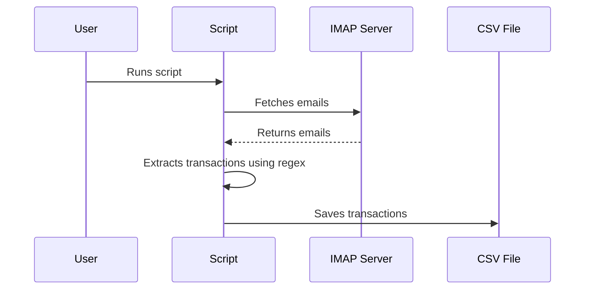

# imap-bills-exporter
Python Imap Bills Exporter

This Python script, main.py, is designed to fetch transaction notifications from an IMAP server, specifically Gmail. It logs in with specified credentials, retrieves email data from the user's inbox, extracts transaction notifications from the email data, saves the transactions to a file, and exports the transactions as text.

## Features

- Connects to a Gmail IMAP server using SSL.
- Logs in with user-provided credentials.
- Retrieves email data from the user's inbox.
- Extracts transaction notifications from the email data.
- Saves the transactions to a text file.
- Exports the transactions as a CSV file.

## Usage

1. Set up your environment variables in a .env file in the same directory as main.py. The following variables are required:

- IMAP_USER_EMAIL_ADDRESS: Your Gmail email address.
- IMAP_USER_PASSWORD: Your Gmail password.
- IMAP_SERVER: The IMAP server address (for Gmail, this is imap.gmail.com).
- IMAP_FILTER: The IMAP filter to use when searching for emails.
- IMAP_BANK_MSG_START: The start string(s) for filtering emails, separated by commas.
- IMAP_BANK_MSG_END: The end string for filtering emails.
- REGEX_BANK_FILE: The path to a file containing regular expressions for parsing transaction notifications.

### Create mamba env
```bash=
mamba env create python=3.10 -f environment.yml
```
### Activate mamba env
```bash=
mamba activate imap
```

### Execution
```bash=
python main.py
```

This will start the script which connects to the IMAP server with the credentials 
provided in the environment variables. It fetches the emails, extracts the transaction 
data and saves it to a file. The transactions are then exported as text.

### Output
The output will be a CSV file named `transactions-<timestamp>.csv` in the `target` directory.
Each row in the CSV file represents a transaction with the following columns:
Type, ValueString, ValueFloat, dest, Date, time, DateTime, Account

### Diagram


This diagram represents the flow of the script. The user runs the script, which fetches 
emails from the IMAP server. The script then extracts the transactions from the emails 
and saves them to a CSV file.

